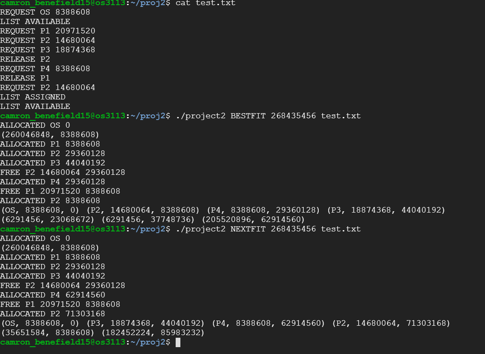
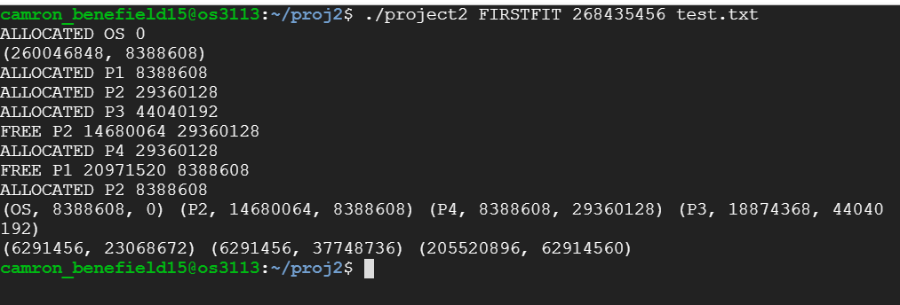

# cs3113fa21-project2
## Project 2
### Camron Benefield
#### EXAMPLE OF RUN
Using a c/c++ compiler from the makefile that is given in order to compile. Run file with passing any input file with the same structure as the example in the project. Image below shows proper steps and output.

#### LIST OF LIBRARIES USED
<stdio.h>
<stdlib.h>
<string.h>
<unistd.h>
<fcntl.h>
<sys/stat.h>
<math.h>
#### ALGORITHM
For this project I used struct array to allocate the processes. The struct consists of a char array for the name of the process, long unsigned integer for size of process, and another long unsigned integer for the startint indicies for the process. I emplemented a couple of helper functions in order to help with the calculations for each algorithm. The "isEmpty" function uses the given struct array to loop through to find any allocations and returns a one if not empty, and two if not. The "allocated" function uses the given struct array to add all the allocated memory and return the total. For the job functions, as in request, release, list available, list assignment, and find, I implemented cut and dry code. Each one has the same prechecks to see if the array is empty, and if the desired process size is small enough. Request function, if empty it adds the process to the first indicies of the array given that the process size is small enough. After, I implemented an array shift from last to the given indicies and then adds the given process and prints the newly allocated process. Release function searches through the struct array to find desired process. If not found returns a negative one, other wise returns the indicies process was found, removes process, shifts array, and prints for confirmation. Find function simply searches array for desired process and prints if found, otherwise prints a fault when not found. List assigned function, if empty prints "NONE", other wise prints out the contents of the struct array. List available searches through struct array and printing all the available memory space inbetween, before, and after all the allocated processes. 
#### BESTFIT ALGORITHM
Bestfit algorithm first aquires the job to execute, given that it is not the end of the file. For request I implemented a "findBestFit" function. This function loops through the array to find the best fit by comparing the deduction of the starting of the following process by the addition of the start and size of current process. Also checks if the available memory before and after processes. If no bestfit is found, it prints fail message. For the job release I just simply used my release function and if it does not find the process to remove, it prints the fail message. For the job list available just simply call available function to complete calculations and prints. Similarly list assigned calls assigned function to complete calculations and prints. Lastly, Find algorithm calls find function to complete search and print. 
#### WORSTFIT ALGORITHM
Worstfit algorithm first aquires the job to execute, given that it is not the end of the file. For this algorithm, it is very similar to bestfit only difference being instead of finding the memory space with the least left over, it finds the most left over. All other jobs are the same.
#### FIRSTFIT ALGORITHM
Firstfit algorithm first aquires the job to execute, given that it is not the end of the file. For request, I implemented a "findFirstFit" function that searches through the struct array to find first available spot big enough for the new process and allocates it. All other jobs are the same. 
#### NEXTFIT ALGORITHM
Nextfit algorithm first aquires the job to execute, given that it is not the end of the file. For request, I implemented a "findNextFit" function that searches through the struct array starting at the previous allocated process indicies. If there is not enough available space, it loops through the array from the beginning to the given indicies to find available space big enough. All other jobs are the same. 
